# FilamentExamples: Laravel architecture and data boundaries

Research date: **2026-10-08**. Source identities, access limits, installed versions, and all eight project links are recorded in the [workspace research](FILAMENT_EXAMPLES_WORKSPACE_RESEARCH.md). This is a source review and proposal, not an executed security/performance audit of the example applications.

## 1. What the examples actually contain

The requested examples emphasize interface composition. Their application inventories mostly contain Filament schema/table/widget classes, Livewire components, Blade, enums, Eloquent models, and providers. They do **not** demonstrate a complete service/action/DTO architecture for our Configurator. Absence is worth recording rather than attributing architecture to a demo that does not contain it.

| Example | Application-level backend pattern | What it does not supply |
| --- | --- | --- |
| E1 Ticket sidebar | Enum transition rules; typed relationships/casts; component performs writes and reads timeline | An authorized atomic transition action, ownership/concurrency boundary, bounded history read model |
| E2 dashboard | Enum date/preset choices; local model scope; widget queries build plugin DTOs | Shared app analytics service, authorization-aware cache contract, consistently bounded aggregate queries |
| E3 custom cells | Eager-loaded relationship; model casts/presentation helpers; Blade presentation | A mutation service or custom Eloquent builder; complete search/action behavior |
| E4 branding | Panel provider composes UI; user model casts/hidden fields | Persisted account-plan/profile-card domain data; new authentication requirements |
| E5 segmented chart | Typed enum filter scope and model aggregate helper | Table filter state, a DTO-based aggregate boundary, exact monetary-calculation semantics |
| E6 context menu | Table action factories, enum labels/colors/icons; plugin provides action adapter | Atomic catalog batch operations, blocker policy, safe duplicate identity allocation |
| E7 sidebar resizing | Provider registers assets/hooks; client owns presentation width | Server service/model for user preferences; table/editor sizing |
| E8 complex form | Private schema methods; ordinary typed Eloquent relationships and casts | A domain compiler, custom casts/builders, aggregate save action, or application DTO layer |

The FilaWidgets **package**, separately from E2's application, is the clearest typed-data example: readonly DTOs, resolver contracts, calculation/formatting helpers, a service provider, and explicit cache serialization. The right-click **package** demonstrates plugin/provider/macro integration and its upgrade coupling.

## 2. Services, actions, and providers

**Use providers for composition.** Panel configuration, assets, hooks, and container bindings belong there. Do not calculate widget data or traverse all catalog relationships during provider boot. Filament UI composition and Laravel dependency registration are separate responsibilities even if both happen through providers.

FilaWidgets' provider loads views and registers its Artisan command; it does not need a panel plugin object for each widget. Right-click uses both a package service provider and `FilamentRightClickPlugin` panel registration. Its global macro registration must be safe to call more than once. The examples' often-empty `AppServiceProvider` does not imply that our existing bindings should be removed.

Our existing [AppServiceProvider](../../../app/Providers/AppServiceProvider.php) registers `App\Services\CatalogRevisions` and `App\Services\AdminAppearance` as **scoped** services, plus table hooks and current authorization. A scoped instance is shared within a request/job lifecycle; independently mounted lazy children make other requests and receive other instances. Avoid singleton caches of mutable current-user/current-record data. Cross-request caching needs an explicit scoped key and invalidation contract. See [Laravel container scopes](https://laravel.com/docs/13.x/container#binding-scoped-singletons).

**Writes stay in existing domain actions.** E1's history/status sequence and E6's direct action closures are sufficient to illustrate their UI, but not a persistence contract for our app. A read-only sidebar must not introduce an alternative write route. All Configurator mutations continue through `App\Actions\SaveConfiguratorDefinition::change()` or the existing domain adapter for that operation. Group settings use `App\Actions\SaveGroupSettings`; status changes use `App\Actions\ChangeCatalogStatus` and its accepted impact choices.

The inspected Configurator action authorizes `manage-catalog`, locks the owner, loads a fresh complete draft, compiles/validates it, checks reference ownership, and persists atomically. A new UI can submit a small intended change; the action merges it with the complete locked definition. It must not save individual mapping/rule cells independently. A failure must leave persisted data intact and keep the user's editable draft available.

```mermaid
flowchart LR
    UI[Filament or Livewire editor] --> A[Existing domain action]
    A --> G[Authorize and lock owner]
    G --> D[Load complete current draft]
    D --> C[Compile and validate]
    C --> P[Atomic persistence]
    P --> E[Successful-save event]
    E --> R[Refresh read-only context]
```

The event is an invalidation signal, not authorization and not the canonical saved object. The listener resolves the trusted owner and reauthorizes. Do not dispatch a “saved” refresh before the transaction succeeds.

## 3. Enums: strong vocabulary, limited authority

E1's `TicketStatus` implements Filament label/color contracts and contains pure transition helpers. E2's preset/date enums centralize labels/options/windows; E5's traffic-source enum feeds both UI and a typed local scope. E6's status enum also provides icons. This is good reuse of one finite vocabulary across UI, casts, and query predicates.

Use the existing app enums and naming conventions rather than creating an example-shaped `App\Enums` hierarchy here. Existing catalog status flags are booleans and accepted behavior includes multi-step Configurator-disable choices; a ticket transition enum does not replace that domain policy. Enum metadata may describe a choice; authorization, fresh dependencies, and writes stay in actions.

Use `tryFrom()` plus explicit validation for untrusted input. Silent fallbacks are reasonable for a nonessential dashboard presentation preference, but inappropriate for a mutation or a filter whose invalid value would widen its scope. A finite choice should be validated with the existing enum/allowlist rule before it reaches a query. Freeze a single clock instant before deriving adjacent date windows; repeated `now()` calls can cross a day boundary.

## 4. Models, relationships, scopes, and custom Eloquent

**Relationships.** E1 types its belongs-to/has-many relationships and adds an index on Ticket plus transition timestamp. E3 explicitly eager-loads industries and uses a unique pivot pair. E8 specifies self-relation pivot foreign keys and ordered child relationships. These are useful conventions: model relationships describe ownership; schema names alone do not enforce it. Client-supplied association IDs still require fresh existence, allowed owner, active/hidden policy, and authorization checks.

**Scopes.** E2's completed-order scope and E5's typed traffic-source scope are ordinary local `Illuminate\Database\Eloquent\Builder` scopes. No custom Builder implementation was found in the inspected application inventories. Reuse small explicit scopes for genuinely repeated predicates. A custom Builder or repository layer is unnecessary just because examples use Eloquent. Do not add a global “active only” scope: our administrators must still see, repair, re-enable, and inspect disabled/hidden records. Public availability continues through the existing availability policy.

**Queries.** Clone a base Builder before independently adding aggregate constraints; E2 does this and avoids accidental cross-metric mutation. Prefer `withCount()` or bounded aggregates for badge/count summaries, and load detailed records only when their drawer/context becomes visible. Keep query work out of Blade and schema label loops. Select the fields and eager-load the relationships actually rendered; keep IDs/FKs needed for relationship resolution.

For E2's per-day count loop, use one grouped aggregate with conditional counts, then fill missing days in PHP. Preserve metric definitions: daily percentages averaged together can differ from a period ratio weighted by total counts. E5's `AVG()` of stored averages needs similar scrutiny before reuse for a real metric. We have not measured query counts or prescribed new indexes for our database; inspect schema and query plans with Boost before any index migration.

Custom-data lists need their own pagination/slicing and allowlisted search semantics. Our `App\Services\ItemLists` returns `App\DTO\ItemListDefinition` with a Builder **or** an array; `App\Livewire\Catalog\ItemListDrawer` handles these explicitly. A paginator label alone does not slice an arbitrary full array. Do not force non-model property lists into a fake resource or relation manager.

## 5. Casts and value normalization

The demos use built-in enum, date/datetime, decimal, and boolean casts. E8's Product model and E2's Order show these at the model boundary; neither supplies a reusable custom cast framework. A cast normalizes stored values for model access; it does not authorize input or prove a relationship/domain rule. See [Laravel casts](https://laravel.com/docs/13.x/eloquent-mutators#attribute-casting).

Our current rule operands use the built-in `array` cast and the compiler validates allowed types/keys/operators. An existing [JsonRuleCast](../../../app/Casts/JsonRuleCast.php) is lenient: malformed JSON reads become an empty array, and its setter returns an array/null. The current `app/` search found **no usage of that class outside its definition**. It is not evidence that current rules depend on custom JSON casting. Do not introduce it into new fields or delete it as part of this research. Any later use would need storage round-trip and malformed-input tests against the actual Eloquent cast contract.

Preserve the distinction between empty, null, invalid, and intentionally removed values. Defaults in a cast must not silently repair or discard an invalid Configurator definition. Keep existing boolean flags and settings JSON validation. Decimal model casts produce decimal representations; converting to float may be acceptable for chart presentation but does not establish safe exact financial arithmetic. The example dashboard's money calculations are not a requirement for this catalog.

E8's `$guarded = []` is a demo convenience. Keep our explicit fillable fields and domain-owned assignment; do not pass an unvalidated Livewire payload directly to `fill()`/`update()`.

## 6. DTOs and plugin resolver structure

FilaWidgets' `SparklineTableRowData` is readonly with typed constructor fields for current/previous values, series, formatting, and optional URL. Explicit `toArray()`/`fromArray()` make its serialization contract visible. Its Widget can obtain data from its own method or a class implementing `ResolvesSparklineTableWidgetData`; Laravel resolves that class's dependencies. Separate formatter/calculator helpers turn that data into display rows.

This is a useful pattern when two real consumers share a read model. It does not justify a DTO for every three-field form or a generic service/repository scaffold. Our `App\DTO\ConfiguratorDefinition` and rule/attribute/option DTOs already express the compiler/evaluator contract. Retain them; a widget DTO is a presentation boundary and cannot replace the engine definition.

If a catalog-health view has enough reuse to need a service, use a focused `App\Services` class returning a small explicit DTO in the existing `App\DTO` directory. Compute once for that request/aggregate, then let the native widget or optional plugin adapt it. Do not return partially selected Eloquent models pretending to carry complete model state. In E5, a date PHPDoc claims a string while the cast-aware consumer expects a date object; a typed read DTO would make such disagreement harder to hide.

Avoid FilaWidgets' internal legacy definition API in new integrations; its `Definitions/SparklineTableWidgetDefinition.php` is marked as compatibility internals. Use the public concrete widget/data/resolver APIs for a chosen approved release.

Pinned package references: [readonly row DTO](https://github.com/LaravelDaily/FilaWidgets/blob/59bc01958ad5a6450c3655d758fb00cd1058d84c/src/Data/SparklineTableRowData.php), [Widget data adaptation](https://github.com/LaravelDaily/FilaWidgets/blob/59bc01958ad5a6450c3655d758fb00cd1058d84c/src/Widgets/SparklineTableWidget.php), [resolver contract](https://github.com/LaravelDaily/FilaWidgets/blob/59bc01958ad5a6450c3655d758fb00cd1058d84c/src/Contracts/ResolvesSparklineTableWidgetData.php), [service provider](https://github.com/LaravelDaily/FilaWidgets/blob/59bc01958ad5a6450c3655d758fb00cd1058d84c/src/FilaWidgetsServiceProvider.php). Its [SparklineSeries helper](https://github.com/LaravelDaily/FilaWidgets/blob/59bc01958ad5a6450c3655d758fb00cd1058d84c/src/Support/SparklineSeries.php) interpolates column/aggregate expressions into raw SQL; keep these programmer-owned constants, never client-supplied field names or expressions. Test database/timezone boundaries for a real date-series integration.

## 7. Cache ownership and invalidation

FilaWidgets caches data only when configured; disabled caching runs the resolver again. Its key includes widget/resolver/filter/options and can use a prefix. It stores DTO class/data information and reconstructs through `fromArray()`. The package does not know our authorization scope or catalog revisions automatically.

For any future cached contextual result, define dimensions explicitly: panel, authorized visibility scope, owner, normalized filters, relevant revision, and DTO schema version. Include user identity where two users can receive different data or action URLs. A TTL alone is not a repair for cross-scope leakage or stale blockers. Follow our existing revision/invalidation mechanism after successful writes; bounded preview caches must invalidate on relevant association/status changes.

Keep **appearance data** separate from **domain data**. Existing admin appearance settings are validated and cached server-side; temporary panel widths can be local browser preferences scoped by user/panel/purpose and version. Never store unsaved forms, rule drafts, model payloads, or sensitive history in a width preference.

## 8. Blade, Alpine, and Livewire lifecycle

Blade renders escaped names/labels and prepared bounded data. Custom colors/HTML require validation; raw HTML must not be used just to make a tooltip multiline. Database access inside a cell/view repeats work and makes query cost harder to control. E3's eager-loading setup is useful; copy the boundary, not every CSS rule.

Alpine owns client-only width, pointer capture, focus, and visual state. Livewire owns authorized mutations and validated form/filter state. Resizing must not remount the editor, call `$refresh`, entangle entire drafts, or perform requests per pointer movement. Livewire 4 advises direct `$wire` access for required server state; its older entangle pattern is deprecated. See [Livewire JavaScript guidance](https://livewire.laravel.com/docs/4.x/javascript).

Stable nested component keys identify the resource/record/tab. Do not key a draft editor by a changing revision counter: that forces destruction/recreation and can lose edits. Computed properties cache for their supported lifecycle, not indefinitely across requests; explicitly invalidate a computed value when changing its underlying model during the same request. Event subscriptions and Resize/Mutation observers need teardown on component destruction/navigation.

Filament's deferred schema loads invisible markup when it becomes visible or validation needs it. It is not equivalent to removing the field from the complete schema or skipping its relationship save. In the existing aggregate editors, do not add native relationship persistence that writes before the domain compiler has validated the whole intended change.

## 9. Helper versus macro: our count-column decision

| Option | Advantages | Costs / risks | Fit here |
| --- | --- | --- | --- |
| Existing `ItemCountColumn` factory + `ItemLists` registry | Explicit imports; searchable source; shared authorization/list definitions; works for model and non-model item lists | Extend signatures deliberately when a real second use requires it | **Preferred baseline, already implemented** |
| Dedicated custom Column subclass | Typed fluent configuration; its own view; useful for genuinely richer repeated markup | Extra class/view and Filament rendering contract to maintain | Consider only when the native TextColumn helper cannot express the UI |
| Global column macro | Short fluent syntax across many column instances | Dynamic discoverability, name collisions, global provider registration, closure binding, package-upgrade coupling | No current need; avoid migrating the existing helper merely for syntax |

The right-click plugin is a concrete example of macro costs: it binds closures to Table internals and maintains its own action/selection adapter. That can be justified for a plugin feature, but our count preview already has a smaller explicit implementation. Keep all owner/list keys allowlisted and reauthorized regardless of presentation syntax. Official reference: [custom column configuration](https://filamentphp.com/docs/5.x/tables/columns/custom-columns).

## 10. Practical reuse rule

Borrow the smallest useful **pattern**: responsive schema composition, typed enum vocabulary, bounded query/read DTO, native action adapter, or local resize state. Keep our current business policies and save boundaries. New services, DTOs, enums, casts, providers, builders, migrations, and dependencies need a concrete consumer or invariant; the examples are not a reason to create them speculatively.
